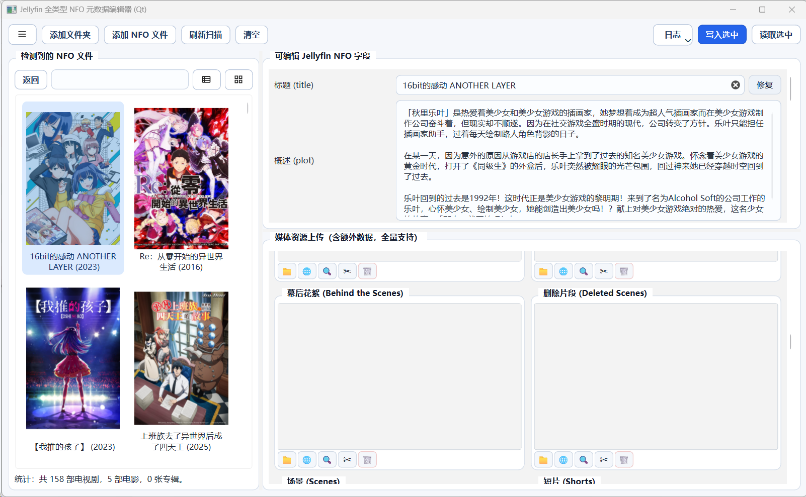

# Jellyfin NFO 全类型元数据编辑器（Qt）

一个面向本地媒体库的桌面工具，核心用于批量扫描、编辑、重命名和维护 Jellyfin/Emby 风格的 NFO 及关联媒体文件。  
项目基于 `PySide6`，支持列表模式与封面图模式，包含视频下载（yt-dlp）、季度偏移、批量重命名、媒体裁剪与片段导出等能力。

---


## 1. 项目定位与主要能力

本工具适合以下场景：

- 本地媒体库（电视剧/电影/专辑）NFO 的集中维护
- NFO 字段批量编辑与写回
- 媒体资源（封面、背景图、视频、音频）关联管理
- 剧集命名规则修复（`SxxExx`）与“季度/集数偏移”迁移
- 从 YouTube/Twitter(X) 等链接下载视频到 NFO 目录

核心功能概览：

- **NFO 扫描与树展示**：递归扫描目录，按媒体类型分层展示
- **列表 + 图表模式**：支持封面网格、详情区编辑
- **字段编辑与校验**：支持常见可写字段、Provider ID 解析校验
- **图片相关**：网络搜索、下载、裁切、替换、额外图片管理
- **视频相关**：右键下载到 NFO 目录、播放/预览、片段导出
- **季批量重命名**：基于 `SeasonX` 目录规则生成/执行重命名
- **季度偏移**：支持批量 `Season/Episode` 偏移与冲突检查
- **会话与历史**：记录部分本地会话状态，便于继续操作

---

## 2. 运行环境要求

### 2.1 必备环境（最小可运行）

- **操作系统**：Windows（项目当前主要针对 Windows 体验优化）
- **Python**：建议 `3.10+`（你当前环境是 `3.13`，可正常工作）
- **Python 包**：
  - `PySide6`（GUI 必需）

最小安装命令：

```powershell
pip install pyside6
```

> 只安装这项即可启动主界面；但很多网络下载/媒体处理能力会受限（见“可选环境”）。

---

### 2.2 可选环境（强烈建议）

#### A. 视频下载增强（yt-dlp + gallery-dl）

- `yt-dlp`：用于下载 YouTube 视频/播放列表及单条推文
- `gallery-dl`：用于下载 Twitter/X 用户主页下的全部视频（yt-dlp 不支持用户主页批量）

```powershell
pip install -U yt-dlp
pip install -U gallery-dl
```

#### B. 高画质合并/转码（FFmpeg）

- `ffmpeg`：用于音视频合并、片段导出、格式处理
- 若缺失，常见现象是最高画质不可用或部分导出功能不可用

安装方式（二选一）：

```powershell
winget install Gyan.FFmpeg
```

或手动下载后加入 `PATH`。

#### C. 下载加速（aria2，可选）

- `aria2c`：若存在会被自动用于 yt-dlp 并发下载；若某视频 aria2c 失败，会自动用 yt-dlp 内置下载器重试

```powershell
winget install aria2.aria2
```

#### D. 图像处理增强（Pillow）

- `Pillow`：改进部分图片/GIF 预览、裁切体验

```powershell
pip install pillow
```

#### E. WebView2 登录确认窗口（pywebview）

- `pywebview`：用于内置登录确认窗口流程

```powershell
pip install pywebview
```

#### F.（仅 `season_renamer_ui.py` 独立运行时）拖拽增强

- `windnd`：仅用于 Tk 版季重命名工具的拖拽输入（主 Qt 程序不依赖）

```powershell
pip install windnd
```

---

## 3. 快速开始

### 3.1 安装依赖（推荐完整版）

```powershell
pip install -U pyside6 yt-dlp pillow pywebview
# 若需从 X（Twitter）用户主页批量下载视频，可额外安装：
# pip install -U gallery-dl
```

并确保：

- `ffmpeg` 在 `PATH`
- （可选）`aria2c` 在 `PATH`

---

### 3.2 启动程序

在项目目录执行：

```powershell
python "jellyfin_nfo_qt_main.py"
```

若报错“缺少 PySide6”，先执行：

```powershell
pip install pyside6
```

---

## 4. 目录与模块说明

主要文件：

- `jellyfin_nfo_qt_main.py`  
  主入口，创建 `QApplication` 并启动主窗口。

- `jellyfin_nfo_qt_window.py`  
  主窗口与大部分 UI 交互逻辑（编辑区、预览区、日志等）。

- `jellyfin_nfo_qt_services.py`  
  网络下载、yt-dlp、季度偏移、季重命名调用、WebView2 helper 对接等服务逻辑。

- `jellyfin_nfo_qt_scan_tree.py`  
  左侧树扫描、右键菜单、多选、重命名等树交互能力。

- `jellyfin_nfo_qt_video_dialogs.py`  
  视频预览、片段处理、导出对话框能力。

- `jellyfin_nfo_core.py`  
  NFO 扫描/解析/写回核心能力。

- `season_renamer_ui.py`  
  季批量重命名核心（被主程序引用）；也可独立运行，支持后台线程执行、同步重命名视频与同名 NFO。

- `tag.py`  
  标签分析工具：扫描目录内视频文件名与 `.yt-dlp-filenames.txt`，按关键词映射输出标签；支持 GUI 与命令行。

- `jellyfin_nfo_qt_webview2_helper.py`  
  登录确认窗口 helper（pywebview）。

---

## 5. 特色功能详解

### 5.1 NFO 扫描与编辑

- 支持对目录递归扫描并展示 NFO 层级
- 支持字段批量写入与校验
- 支持未保存修改切换前确认

### 5.2 图片工作流

- 可从网络搜索并选择图片
- 支持图片裁切与写回
- 支持主图与额外图片（extras）管理

### 5.3 视频下载到 NFO 目录

- NFO 右键可发起下载
- **YouTube**：视频页、播放列表（yt-dlp）；支持 aria2c 加速，失败时自动回退到内置下载器
- **Twitter/X**：用户主页批量下载使用 gallery-dl；单条推文可用 yt-dlp
- 下载命名、metadata/缩略图嵌入、Cookie 登录重试已集成；存档与暂存目录在本地（`%LOCALAPPDATA%`），避免网络盘卡顿

### 5.4 季批量重命名与季度偏移

- 季批量重命名会同时重命名视频文件与同名 NFO，且统一将季集标识规范为大写（如 `S03E001`）
- 大量文件时在后台线程执行，避免界面卡死
- 支持季号/集号偏移与目标冲突检查、执行前预览与确认

### 5.5 图表模式与列表模式

- 列表模式：偏结构化编辑
- 图表模式：大图封面与详情联动，支持右键快捷操作

---

## 6. 常见问题（FAQ）

### Q1: 启动时报 `缺少 PySide6`

安装：

```powershell
pip install pyside6
```

### Q2: 下载视频失败，提示找不到 yt-dlp

安装：

```powershell
pip install -U yt-dlp
```

### Q3: 只能下到低清晰度或无法合并音视频

通常是缺少 `ffmpeg`，请安装并加入 `PATH`。

### Q4: 登录流程异常（WebView2）

请先安装：

```powershell
pip install pywebview
```

### Q5: 可以删除 `season_renamer_ui.py` 吗？

当前**不可以直接删除**。  
主程序仍在导入其中的重命名核心函数，删除会导致导入失败。

### Q6: X（Twitter）用户主页下载失败，提示需登录或找不到 gallery-dl

- 用户主页批量下载依赖 `gallery-dl`，请安装：`pip install -U gallery-dl`
- 若提示需要 Cookie，在工具内按提示使用「Twitter/X 登录」流程后再试

### Q7: 标签工具 `tag.py` 怎么用？

- **GUI**：`python tag.py` 或 `python tag.py <目录路径>`，可选路径后点扫描，结果可复制
- **命令行**：`python tag.py --cli <目录路径>` 输出到控制台

---

## 7. 运行时生成的缓存/状态文件

**项目目录下（可按需清理）：**

- `.nfo_image_cache/`：下载或处理中间图片缓存
- `.nfo_video_cache/`：下载或处理中间视频缓存
- `.nfo_extra_cache/`：额外资源缓存
- `.season_renamer_history.json`：季重命名历史（仅当使用季重命名时）

**本地应用数据目录（`%LOCALAPPDATA%`）：**

- `jellyfin-nfo-tools\.jellyfin_qt_session.sqlite3`：会话与扫描缓存（避免网络盘锁表）
- `yt-dlp-archives/`：yt-dlp 下载存档（按根目录区分，避免重复下载）
- `gallery-dl-archives/`：gallery-dl 下载存档（X 用户主页去重用）
- `bgutil_pot_server/`：YouTube POT 认证服务（若使用 yt-dlp 的 POT 插件时自动创建）

> 清理缓存前建议先关闭程序，避免并发读写。

---

## 8. 建议的开发与测试流程

1. 先安装最小依赖并确认主界面可启动  
2. 再补齐可选依赖验证下载/导出能力  
3. 每次改动后重点回归：
   - NFO 扫描与树交互
   - 编辑保存
   - 季度偏移预览与执行
   - 视频下载（普通链接 + playlist）

---

## 9. 启动命令速查

```powershell
# 进入项目目录后
python "jellyfin_nfo_qt_main.py"
```

